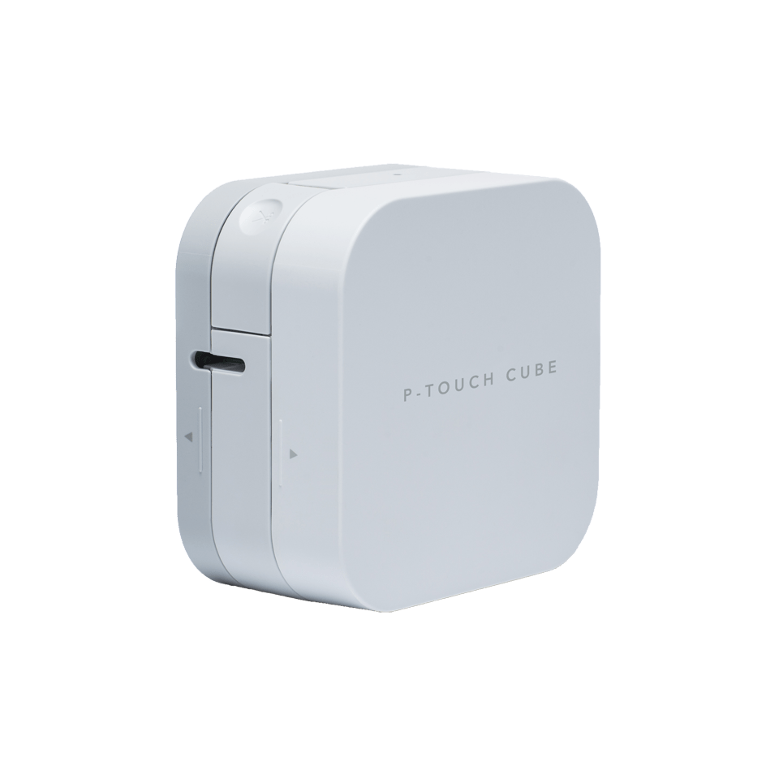
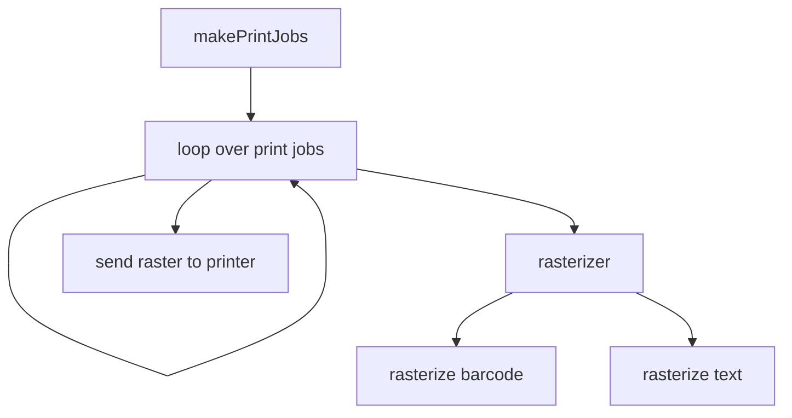

⬆️ For table of contents, click the above icon

Print text and barcodes from command line to Brother P-Touch printers.

TODO: a web service.

WARNING
-------

Currently it's shit code.

Tested hardware
---------------

Brother P-Touch Cube PT-P300BT

Other models may work, but are not guaranteed to do so.

12 mm tape

Quickstart
----------

Overall flow:

1. Download this software from GitHub releases page
1. Make printer available as a serial port (has to be done only once)
	* Run `$ sudo bluetoothctl`
		* Type `scan on`
		* Find device with name beginning with `PT-P...` (the name is the Brother printer model name)
		* Type `pair <bluetooth address>` (where the address is something like `EC:79:49:...`)
	* Then `$ sudo rfcomm bind 0 <bluetooth address>`
		* This should make `/dev/rfcomm0` appear
1. Print to it
	* `$ ./bro datamatrix helloworld hello.png`
	* `$ ./bro print hello.png`

Architecture
------------

Thanks
------

- https://github.com/robby-cornelissen/pt-p710bt-label-maker
	* Got me started on reverse-engineering this and serves as the base for the initial port
